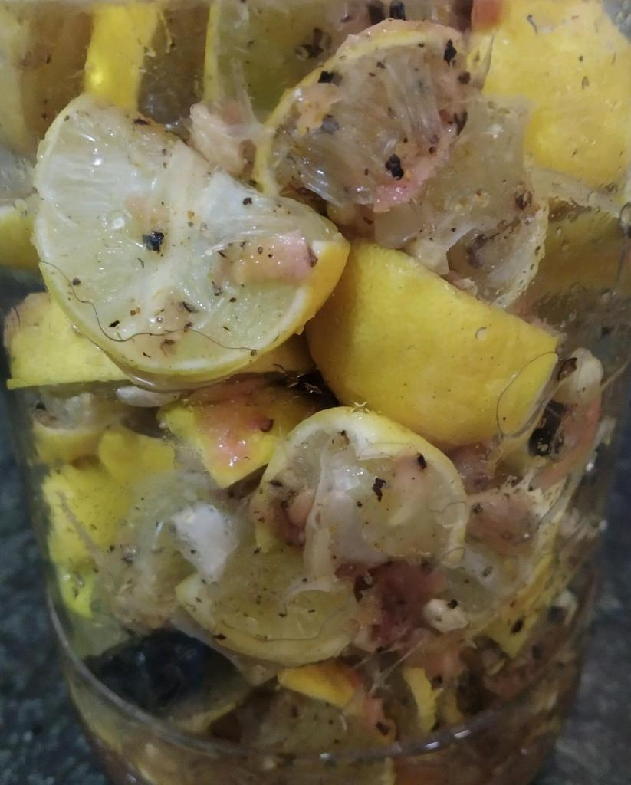
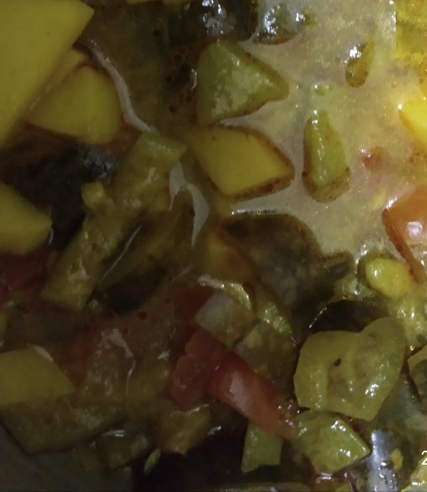
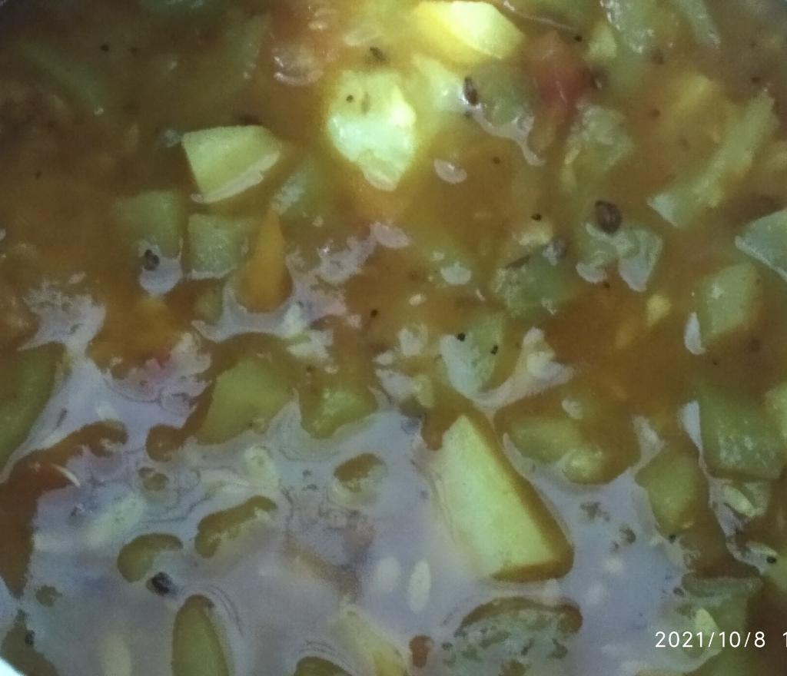
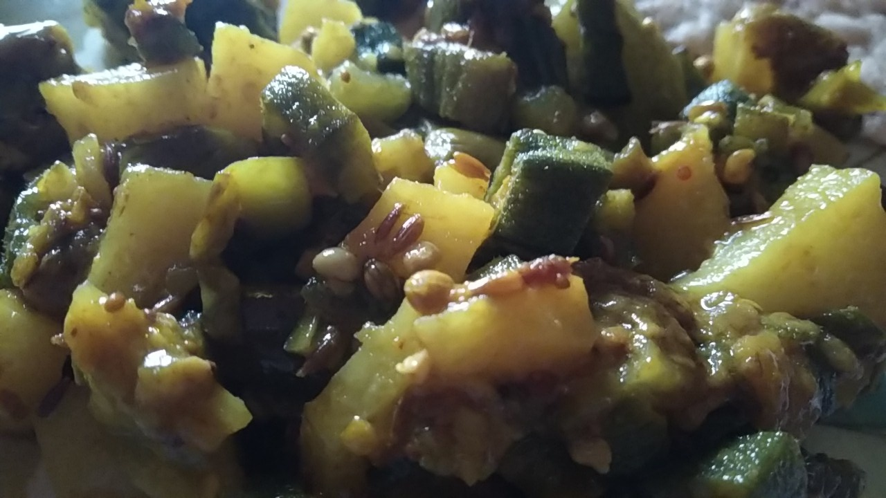
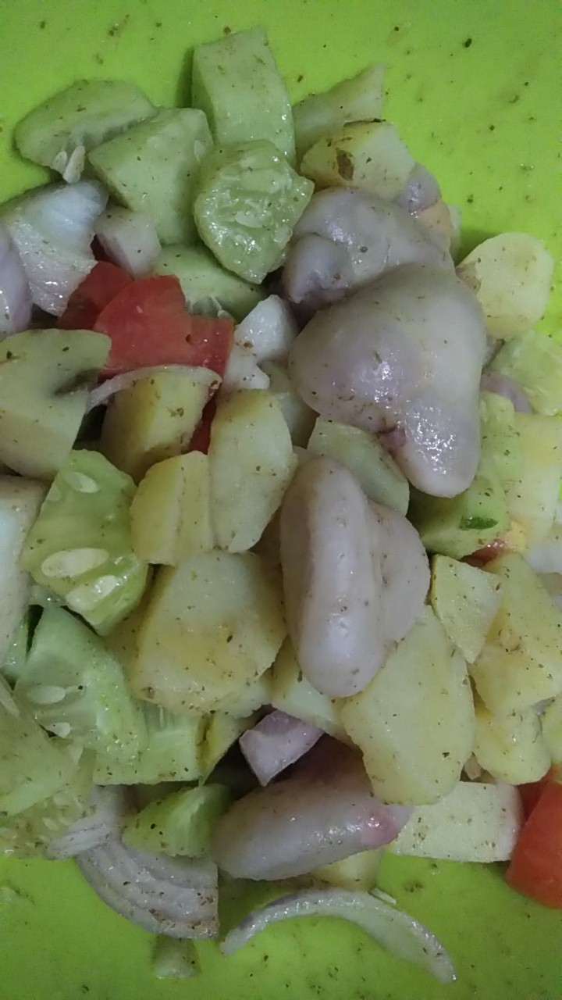
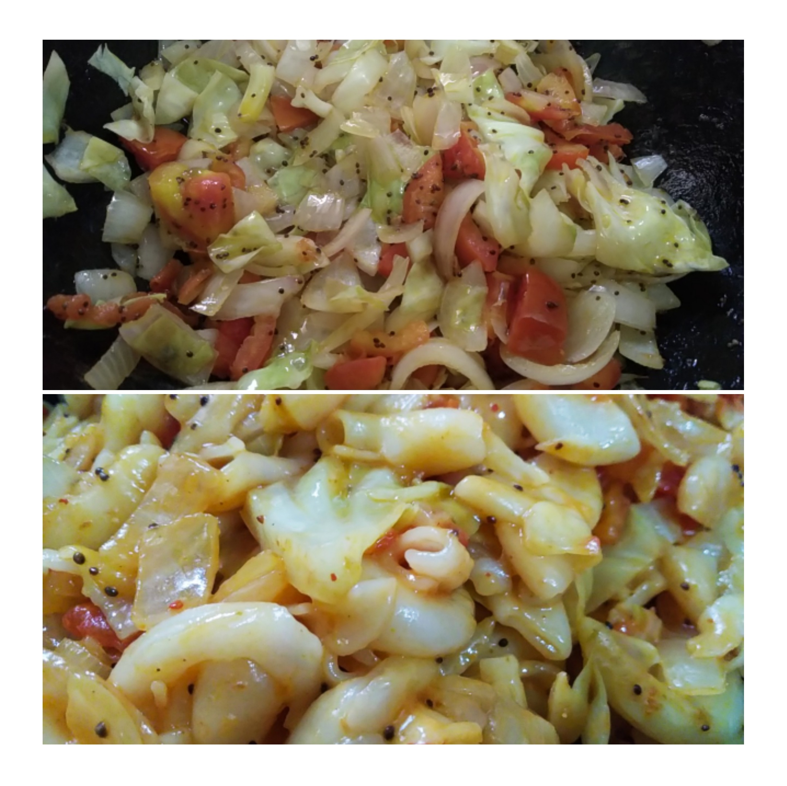
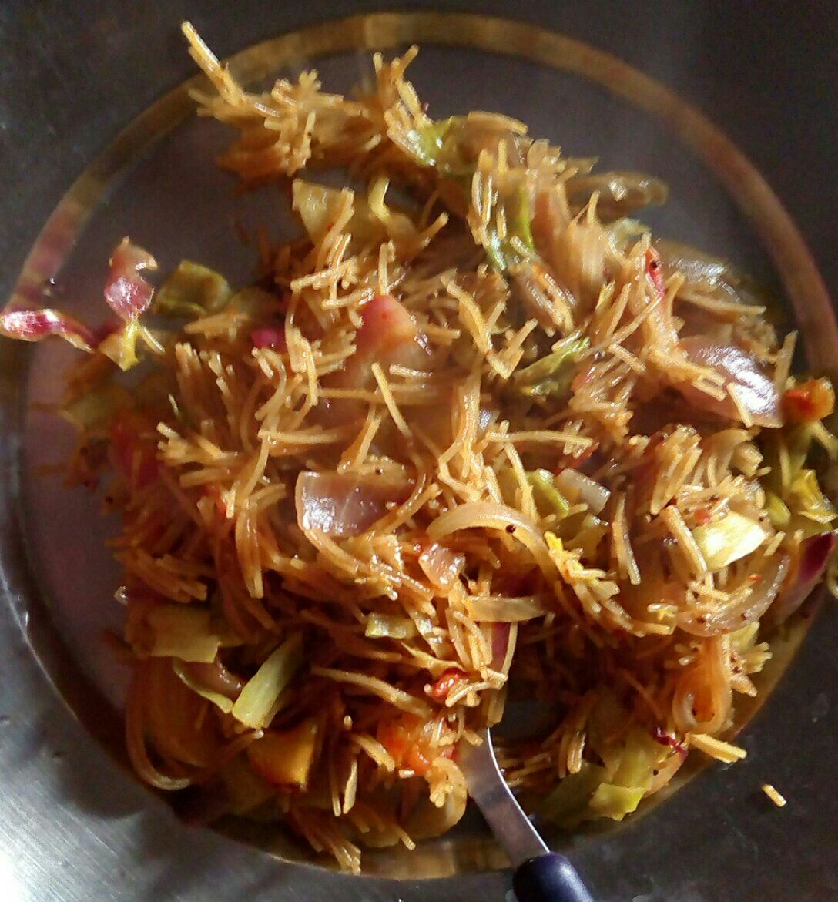

# 2021

### 2021-01-28

MFT Mandua Atta Paranthas

Note: 

 1.  Use some buffalo ghee in winters when kneading dough. 
 2. No need to add salt to the dough. 
 3. Warm water and ghee are sufficient to make dough soft. 
 4. Use millets. 

 1.  Mixed with wheat. 
 
### 2021-02-13 

MFT Mustard Sambhar 

Ingredients: 
  - Mustard leaves
  - Soya leaves
  - 2 onions
  - 1 carrot
  - 3 turnips
  - 2 slices of kaddu
  - Ginger grated
  - Garlic 
  - Lentils: Arhar, Moong mixed

Made exactly as it is made. 

Had put some soya in Chhaunk too. 

### 2021-02-24

MFT Channa Urad Lentil Sambhar

Ingredients: 

  - 1 potato
  - 2 onions
  - 1 tomato
  - 1 carrot
  - 1 capsicum
  - 1 piece of cauliflower
  - Few slices of garlic

Preparation method same. 

### 2021-04-07

MFT BOM (Beetroot Onion Mint) Salad

  - 1 big beetroot grated
  - 2 medium size onions chopped
  - 10-12 mint leaves finely chopped
  - 1/2 lemon's juice 
  - black salt 
  
All mixed together and served with food. 

### 2021-04-11

Maggi tips

#### Atta noodles

  - Cook in pressure cooker getting 3 whistles. 
  - Put chopped one onion in two Patanjali packets. 
  - Add pinch of salt, red chilli powder, turmeric. 
  - Add about three spoons of tomato ketchup. 
  - Water just for boiling. 
  
#### Maida noodles

Can be cooked in pan. Need relatively less boiling. 

### 2021-04-25

Bitter gourd dry curry

  - Curry leaves one bowl 
  - One tomato
  - 2 small onions
  - 2 green chillies
  - All of above sauted together in rai seeds. 
  - Then 2 bitter gourd first cut from middle then further chopped into slices to be added and sauted all together. 
  - Add salt, turmeric, red chilli powder, as per taste. 
  - When everything is cooked, curry leaves would d

### 2021-06-20

Pudina paranthas

Knead dried pudina with ajvain in aata. Make paranthas. 

Note - Mother doesn't take curd. Misses on pudina. Thus pudina being kneaded in wheat. 

### 2021-06-27

Aloo Bottle guard Onion Capsicum curry (gravy) MFT

  - Constraint: No tomatoes
  - No garlic used. 
  - 3 potatoes, 1 onion, 1 capsicum, a big piece of bottle guard
  - Chhaunk: Jeera, Methi seeds, Saunf, Heeng 

### 2021-06-30

Chholey in cooker in one go MFT

  - Chhaunk in cooker first: Saunf, Heeng, Methi seeds, Dhaniya, Rai, Jeera, Tomato Onion Garlic paste
  - Add whole day soaked Chholey
  - Cook on low flame (5 whistles. I took remaining 2 whistles on high flame due to time shortage) 
  

And it's made! Boiling, Chhaunk, etc need not be in different steps. Heavenly taste! 

### 2021-07-14

Pear Juice / Pear Lemon Squash MFT 

  - Peel off four pears, cut into slices, remove seeds. 
  - Squeeze half lemon (or as per taste).
  - Add sugar, salt, black salt, chat masala. 
  - Add 3-4 glasses of cold water. For squash/juice/smoothie.  
  - Mix in food processor. 
  - Serve fresh. 

### 2021-07-17 

Lemon pickle MFT

  - Half kg lemons washed and peels dried. 
  - 4 spoons of sugar
  - 1-1.5 spoons of salt
  - About 1-2 spoons of black pepper (crushed) 
  - 7-8 harad
  - One big ginger piece grated
  - 1 spoon garam masala 

Mixed and bottled in glass jar. 

As on 2021-07-17:

###  2021-09-03

Raw Bananas Potato (gravy) curry MFT

- 3 bananas
- 3 potatoes
- Onion, tomato, garlic, ginger grinded
- Chhaunk spices, less ghee used 
- 5 whistles in pressure cooker on low flame

### 2021-09-08

Nutri Nuggets Pasta MFT

- Nutri Nuggets (Soyabean) soaked, grinded
- 3 capsicums
- 2 onions
- 2 tomatoes
- All cooked, salt added. Pasta added. Ketchup, mayonnaise added. Mixed well. Cooked for 2 minutes. 

### 2021-09-22

Cucumber Pulao Khichdi MFT 

- On potato, one cucumber, one tomato. 
- One small glass rice. Soaked. 
- Chhaunk: One spoon ghee, cumin seeds, rai seeds, heeng. 
- Cooked with more water. 
- 4 whistles. Low flame cooking. 

Great taste! 

### 2021-09-24

Aloo Kaddu MFT

Pumpkin from [kitchen garden](https://nehalsin.github.io/naisargik-kitchen-garden-uttarakhand/)! 

- Chhaunk: Mustard oil, cumin seeds, rai seeds, dhaniya seeds, heeng
- Tomato, onion added. 
- Potato, unpeeled pumpkin added. 
- 5-6 whistles on low flame in pressure cooker. 

Great taste and color! 

### 2021-09-30

Haste Jawein MFT 

- Vermicelli roasted.
- Chhaunk: Rai
- Onion, peas added. 
- Cooked in water with vermicelli. (About 5 minutes)
- Tomato Ketchup topping

### 2021-10-05

Eggplant Pakoras 

### 2021-10-08

Aloo lauki kheera MFT 

- Chhaunk: Rai, Heeng, Jeera, Dhaniya, Methi, Tomato, 3 Green chillies (ripened)
- One cucumber, similar sized bottle guard and one potato for curry
- 5-6 whistles on low flamed pressure cooker

Great taste! 

### 2021-10-09

Aloo kheera baingan bhindi MFT dry curry 

- One cucumber, two eggplants, two potatoes, 10-15 lady fingers
- Chhaunk: Rai, Jeera, Heeng, Dhaniya, Methi, Two Green chillies

### 2021-10-23

Potato Water Chestnut Curry MFT 

- Onion, tomatoes, green chillies, ginger gravy prepared. 
- Chhaunk. 
- Put boiled, peeled potatoes and water chestnuts in gravy for proper cooking together with all ingredients. 

### 2021-10-25

Water chestnut salad MFT

- Boiled water chestnuts and potatoes
- One Onion, Cucumber 🥒, Tomato
- Black salt, lemon juice

### 2021-10-25

Paneer Beans MFT 

- Gravy. Onions, garlic, tomatoes, green chillies, ginger.
- Chhaunk. Usual unprocessed spices. 
- Beans. Cooked without pressure cooker lid. 5 minutes. 
- 3 pressure cooker low flame whistles with paneer. 

### 2021-10-30

Cabbage Macaroni MFT

- Chhaunk: Rai seeds
- Vegetables: Onions, Tomatoes, Cabbage 🥬

### 2021-11-03

Aloo Beans Bhinss MFT

- Gravy paste: Tomatoes, Ginger, Green chillies.
- Chhaunk: Ghee, Dhaniya seeds, Methi seeds, Heeng, Rai seeds, Cumin seeds.
- One Lotus Stem, Two potatoes, several beans.
- 5-6 pressure cooker whistles on low flame.

Excellent. Great taste of ginger, chillies with beans. Beans are great for gravy curries. Great discovery. Photograph not clicked. 

### 2021-11-12

Seb kaddu aloo sookhi sabzi MFT 

- Chhaunk: Heeng, Dhaniya seeds, Methi seeds, Rai seeds, chopped tomatoes and garlic
- Three apples (unpeeled), half middle sized pumpkin, one peeled small potato (risk free step) 
- (Salt, Red chilli, Garam masala, turmeric etc as per taste)
- One small piece of jaggery. 
- 6-7 whistles pressure cooked on low flame. 

Photograph not clicked. NC. 

### 2021-11-18

Aloo Palak Apple 🍏 MFT

- Chhaunk: Rai seeds, Jeera seeds, Dhaniya seeds, Mustard oil, Heeng
- One Tomato, Two onions, Two Apples (unpeeled), Two Potatoes (peeled), Spinach
- Light spices. 
- 5-6 whisles on low flamed pressure cooker. 

Great taste added by apples to yield subtle sour taste to semi liquid like curry! Photograph not clicked. 

### 2021-12-02

Aloo Lauki Palak MFT 

- Chhaunk: Rai seeds, Jeera seeds, Dhaniya seeds, Methi seeds, Heeng, Ghee
- One chopped tomato, two garlic bulbs 
- Spinach, three potatoes, half bottle guard
- Light processed spices
- Half glass water
- 8-9 whistles on low flamed pressure cooker

### 2021-12-04

Desi Chinese Javein MFT

- Vegetables: Tomato, Onion, Cabbage
- Soya Sauce, Vinegar used at end. 

### 2021-12-09

Aloo Radish leaves Methi leaves MFT

- Chhaunk: Ghee, Rai seeds, Dhaniya seeds, Jeera seeds, Heeng
- Tomatoes, Onion, Garlic
- No water added. 
- All vegetables pressured cooked on low flame till 9 whistles with light, other processed spices. 
- Mixed properly after steam ends. 

### 2021-12-10

Aloo Radish Cauliflower (stems and leaves) MFT

- Chhaunk: Mustard oil, Dhaniya seeds, Heeng, Methi seeds, Rai seeds, Jeera seeds
- Tomato, Garlic
- Chopped vegetables
- No water added. 
- 8-9 whistles on low flamed pressure cooker with light, other processed spices. 
- Mixed properly after steam ends. 

### 2021-12-15

Shalgam Aloo MFT 

- Chhaunk: Mustard oil, Dhaniya seeds, Heeng, Methi seeds, Rai seeds, Jeera seeds
- Tomato, Garlic, Turnip, Potato added
- Light processed spices
- No water
- 8-9 whistles on low flamed pressure cooker
- Mixed properly after steam ends. 

## Nice Combinations (NC) and Insights

- 2021-10-07: Urad and Yellow Moong NC lentil curry. 
- Don't use too much water in makki aata kneading. 
