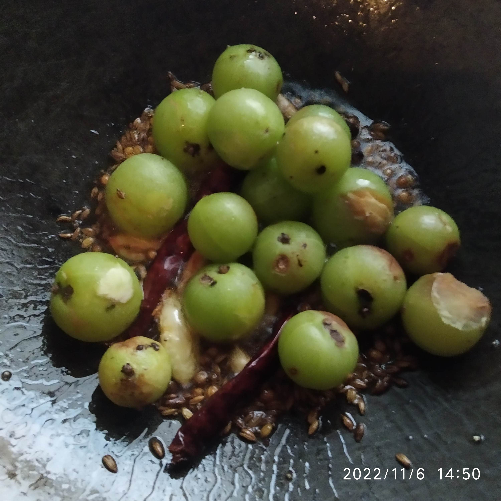
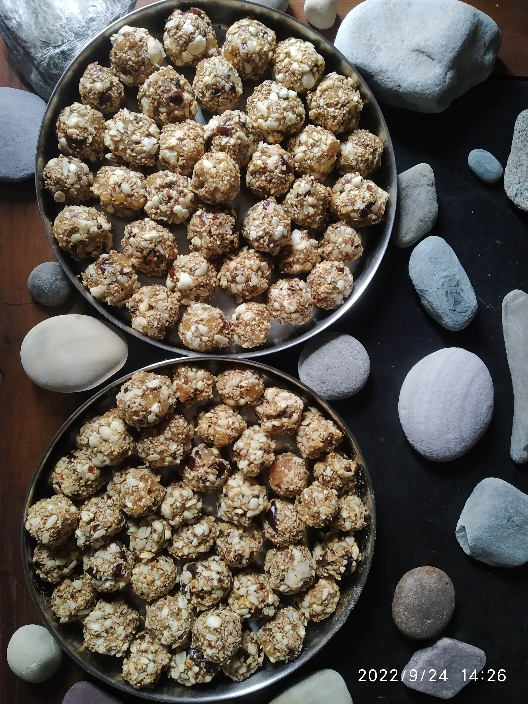

# 2022

Latest on top

## November

### 2022-11-06

**Amla Chhaunka** 

- Amlas washed. Chhaunk or tadka prepared with coriander seeds, fennel seeds, fenugreek seeds, cumin seeds, rai seeds, stone crushed masala (nutmeg, cinnamon, black pepper, clove, cardamom), black pepper, 2 dried chillies, few garlic cloves.

- Add Amlas once the tadka is prepared and garlic cloves are not completely fried. 

- Add turmeric powder and salt. Mix everything. 

- Cover with lid or plate for a few seconds on low/medium flame. 

- Check Amlas. Once almost cooked put off the stove. Keep Amlas covered with lid/plate to completely cook in steam for a few minutes. 

- Complete Cook Time (from time stamps) - 22 mins. 

## October

### 2022-10-03

#### _Sooji_ halwa 

- Roast _sooji_ in coconut oil until it starts giving aroma. 
- Add hot water with shakkar mixed in it. 
- _Sooji_ swells and cooks completely. 
- Add raisins and grated dried coconut and mix in halwa. 
- Don't wait to switch of choolah after halwa totally solidifies. Just put flame off when sooji is completely cooked (semi solid state). 

#### Makki gehu aata poori

- Dough 
    - Dried Moringa flowers
    - Dried Moringa leaves
    - Dried Harsingar flowers 
    - Carom seeds
    - Cumin seeds
    - Makki flour
    - Wheat flour
- Kneaded first with water then with oil. 

### 2022-10-01

Apple Ginger Jam made in _shakkar_ 

- Apples (_Golden Delicious_ apples used here) ginger grated. About 10-12 apples. 
- Jam masala crushed with stone. 
    - Nutmeg (Jaeyphal)
    - Cinnamon (Dalchini)
    - Black pepper (Kali mirch)
    - Clove (long) 
    - Cardamom (elaichi)
- Coconut oil heated in iron saucepan. 
- Grated apples and ginger added and cooked. 
- Once half cooked add _shakkar_ (10-12 spoons). 
- Once almost cooked add jam masala (about a spoon of total mixed masala). 

##  September

### 2022-09-24

Dates based sugar-ghee-cereal free Laddus

- Heated in pan separately: 
    - Raw Groundnuts
    - Sesame seeds
    - Raisins
    - Fox nuts 
    - Black pepper, clove, cardamom (very less heated)
- Grinded with stone: 
    - Raw Groundnuts
    - Raisins
    - Fox nuts 
    - Black pepper, clove, cardamom
    - Dates
- Grated: 
    - Dry Coconut
- All above mixed in platter (paraat) with Magaj (here, pumpkin seeds) Seeds and shaped into Laddus. 

## August

### 2022-08-21

Moringa Mix daal

- Mix daal made in moringa leaves and three chopped onions. Turmeric, salt put at time of cooking with 6 pressure cooker whistles. 
- Chhaunk: Kalaunji, til, ajvain and black pepper

### 2022-08-20

Moringa Porridge

- Chhaunk: Kalaunji, til, ajvain, crushed black pepper
- Tomatoes, onions chopped. Washed Moringa leaves. 
- Roasted broken wheat
- Daliya made in turmeric and salt mixed after putting in pressure cooker. 
- 3 whistles

### 2022-08-18

Banana aloo sabzi

- Two cut ripe bananas without peels. 
- Two medium sized potatoes medium sized cut. Not finely chopped or sliced. 
- Chhaunk: Kalaunji, til, ajvain
- Gravy: Chopped tomatoes, besan
- After sauting, tomatoes and besan gravy made. Potatoes, bananas, salt, turmeric and crushed black pepper added. 
- 5 whistles in pressure cooker. 
- Wonderful curry with tomato, besan, banana gravy and amazing taste of potato! 

### 2022-08-16

Aloo Shimla mirch 

- Sliced potatoes, capsicum, onions, tomatoes and garlic 
- Chhaunk: Mustard oil, kalaunji, heeng, crushed black pepper, dried curry leaves
- Cooked, mixed well and served. 

### 2022-08-09

Tomato Salad

- Finely chopped tomatoes (4-5 medium sized)
- Crushed black pepper, black salt and jaggery powder
- Mixed well
- Kept aside for about ten minutes before serving.

### 2022-08-01

Beetroot Onion Salad with Malka whole and methi seed sprouts

- Grated beetroot, chopped onions, malka sprouts, methi seed sprouts mixed with black salt, chat masala and mousambi juice. 

## July 

### 2022-07-29

Beetroot Onion Salad with Moong sprouts

- Grated beetroot, chopped onions, moong sprouts mixed with ajvain leaves (crushed), chat masala, black salt and lemon juice. 

## February 

### 2022-02-11

Broccoli Leaves, Cauliflower Leaves, Potato curry 

- Chhaunk: Mustard oil, Dhaniya seeds, Rai seeds, Heeng 
- Add finele chopped leaves and thin slices of potatoes. 
- Salt to taste, Turmeric, Sabji masala
- Miz well, add half glass water, cook for 15-20 minutes on low flamed pressure cooker (in my case, this happened without pressure cooker whistles). 

### 2022-02-07

Ripe guava sweet sauce style curry.

- Almost Zero Oil Cooking: One teaspoon of mustard oil for Chhaunk. Dhaniya seeds, Rai seeds, Saunf. 
- Medium sized pieces of ripened guavas.
- Salt, Curry masala, Turmeric as per taste. Crushed black pepper.
- _Shakkar_ for sweetness as per taste. 
- Ten minutes cooking in pressure cooker on medium sized flame. 

### 2022-02-06

Hot Ripe Guava Salad 🥗

- Put guava pieces, salt, chopped black pepper, chaat masala, lemon pickle syrup two tea spoons, _shakkar_ one tea spoon in kadhai on high flame and keep tossing for 60-120 seconds. 

## January - February

## Insights

1. Adding Carom seeds to namkeen porridge makes it all the more delicious. 
2. Make pumpkin with little ginger grated. 
3. Gooseberries ginger jam is a big thumbs-up! 
4. Carom seeds' fermented (wheat) dough can be used to make [bread/bun](IMG_20230101_174307.jpg) after 24 hours of kneading (Oct, Dehradun). Heat until it's completely cooked on low flame with it covered with glass/steel lid. No foul odor. 
5. **Tadka for sprouts:** Asafoetida, Carom seeds, Rai seeds, dried curry leaves. **Additional** -> Moringa leaves' powder, garlic cloves, can even add chopped onions/spring onions. Use only black salt in sprouts' recipe. 
6. Make ram/pahadi karelas (bitter gourds) in pressure cooker. 
7. Putting crushed _chhoti harad_ in lemon pickle is better than putting uncrushed ones. 
8. About 18 hours soaked black gram can be cooked with potatoes or any other vegetable in iron pan (_sookhi sabzi_) without pre boiling.