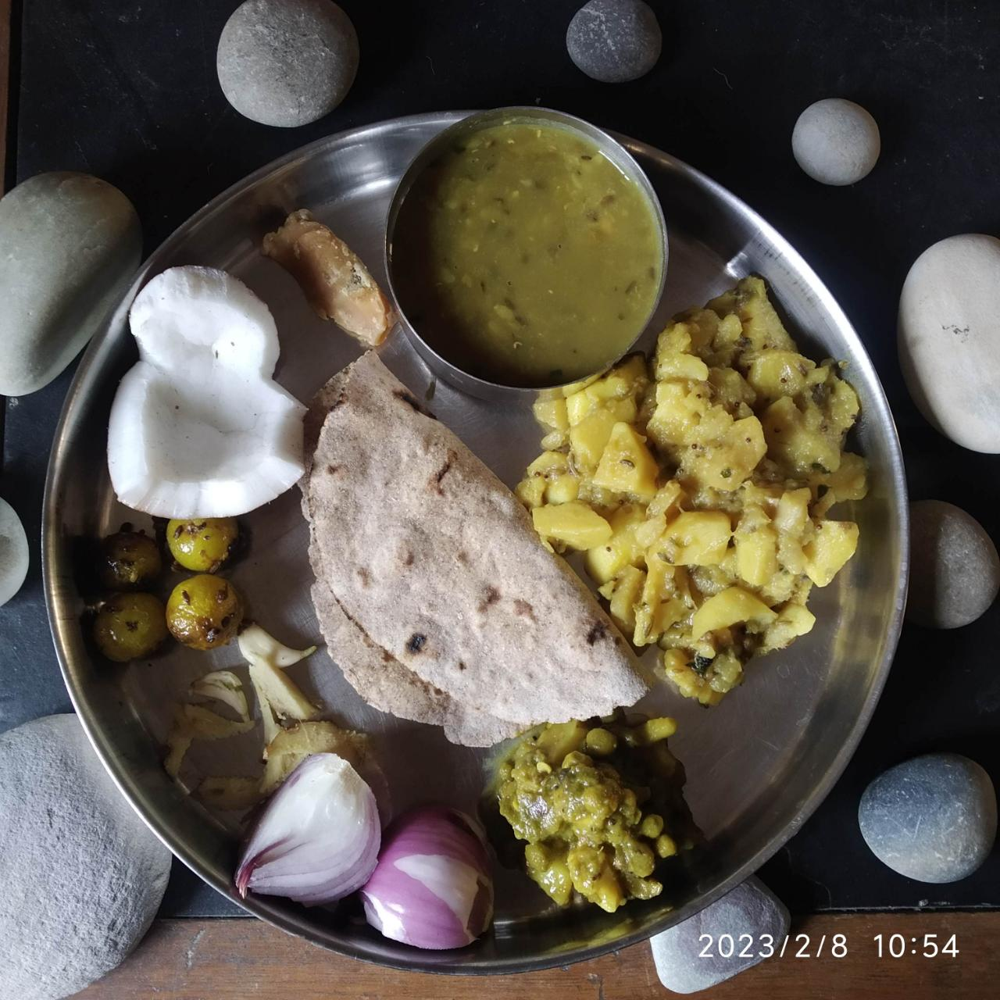
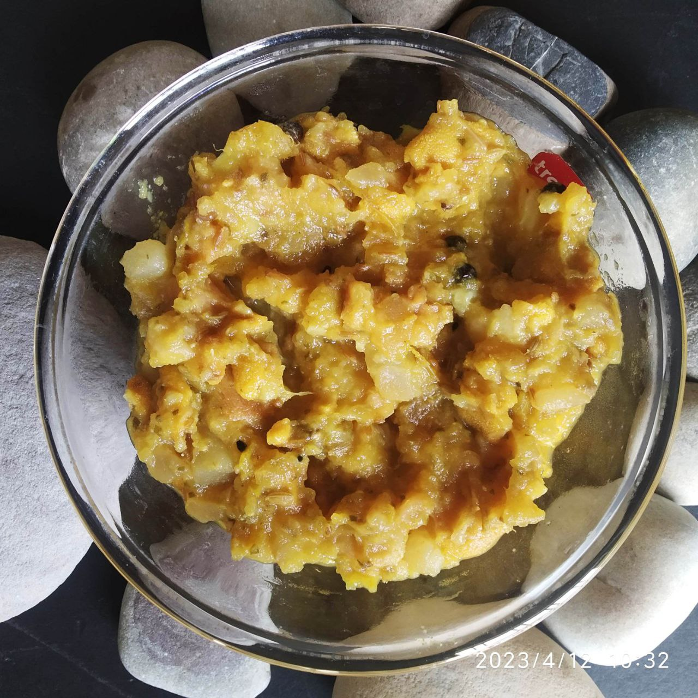
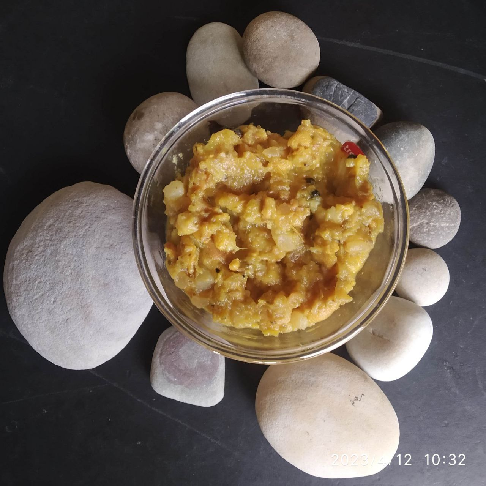
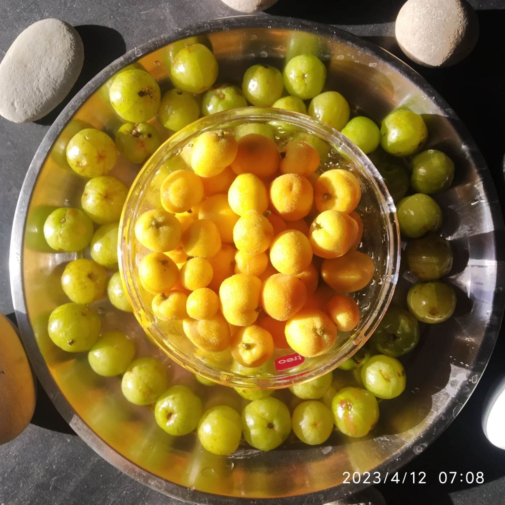
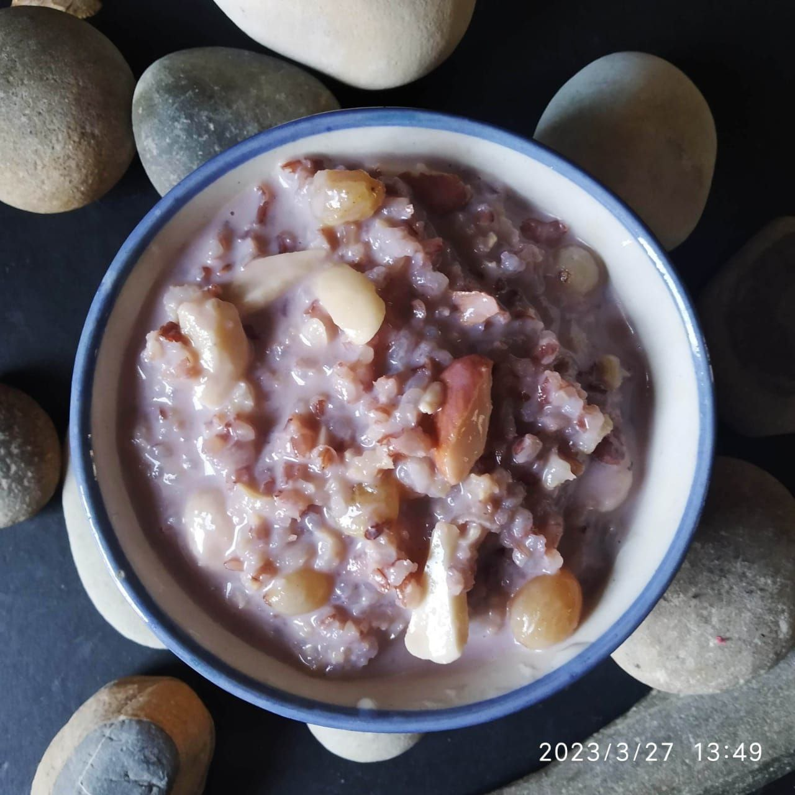
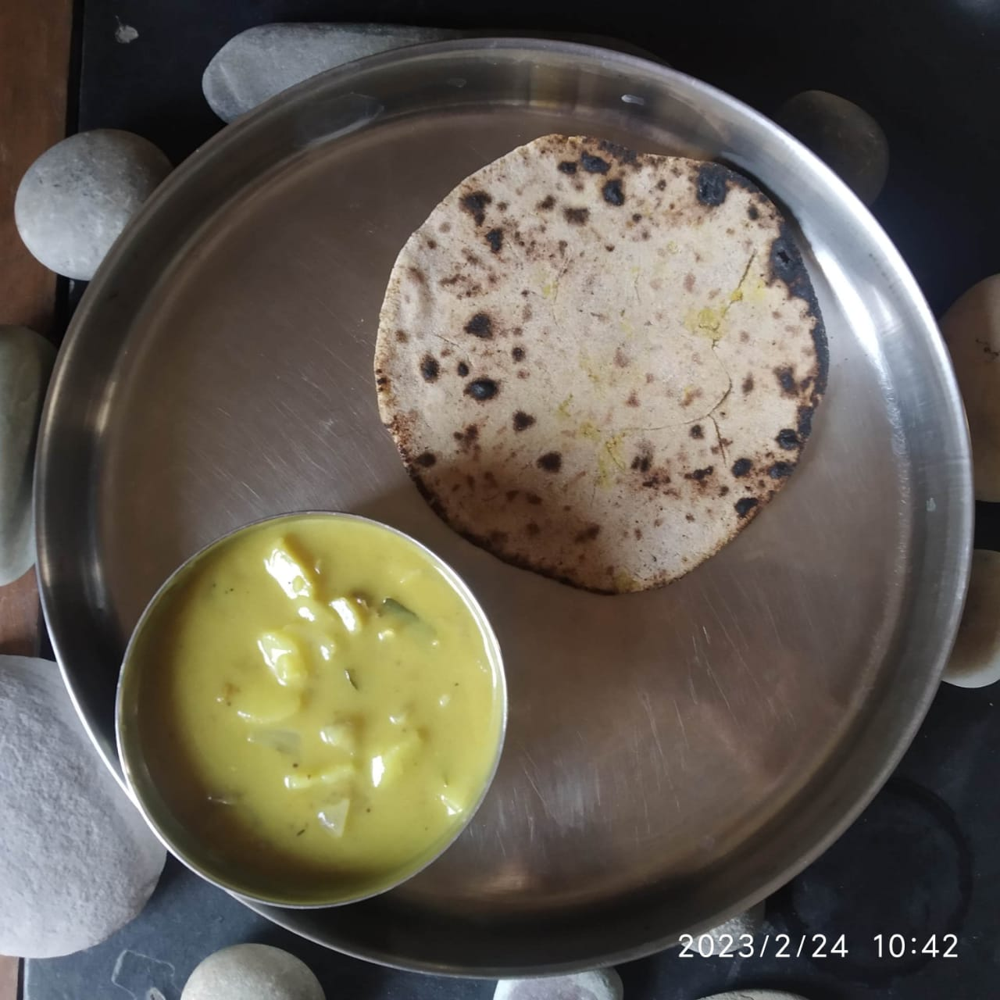
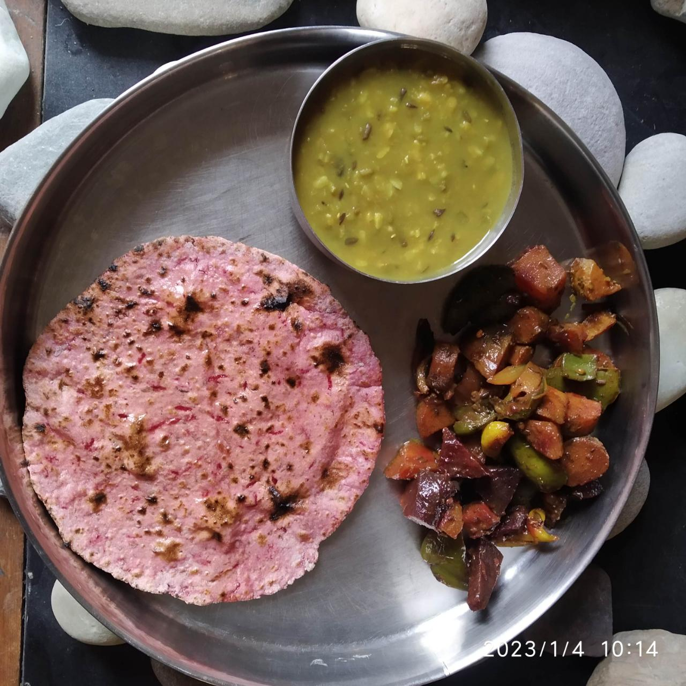
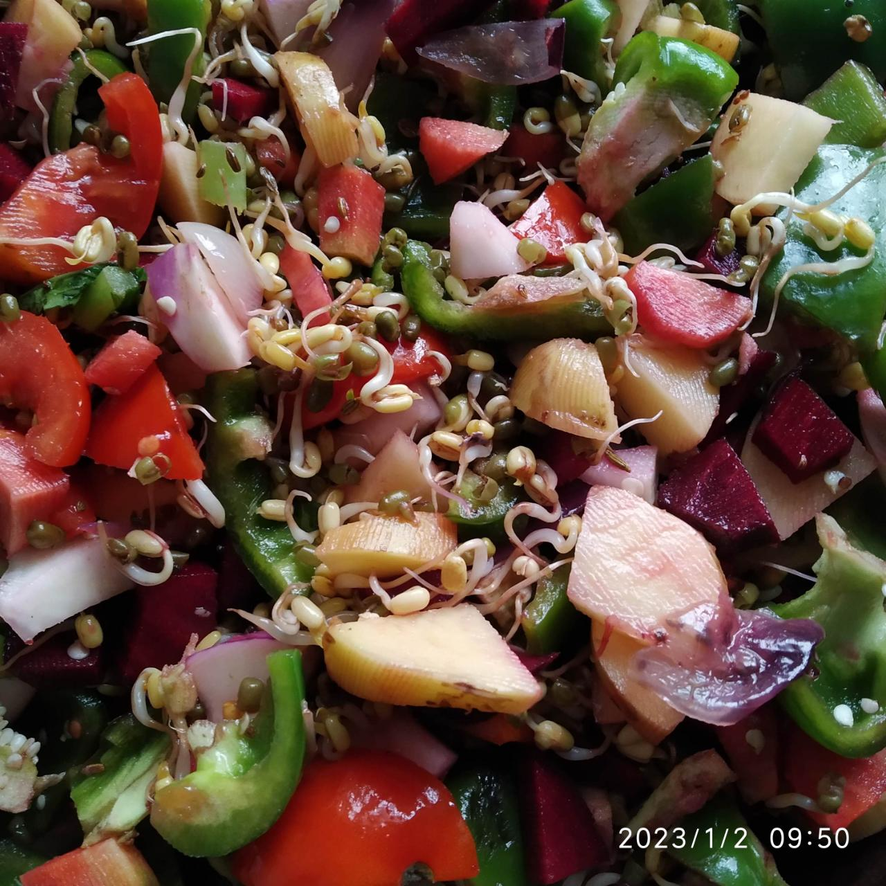
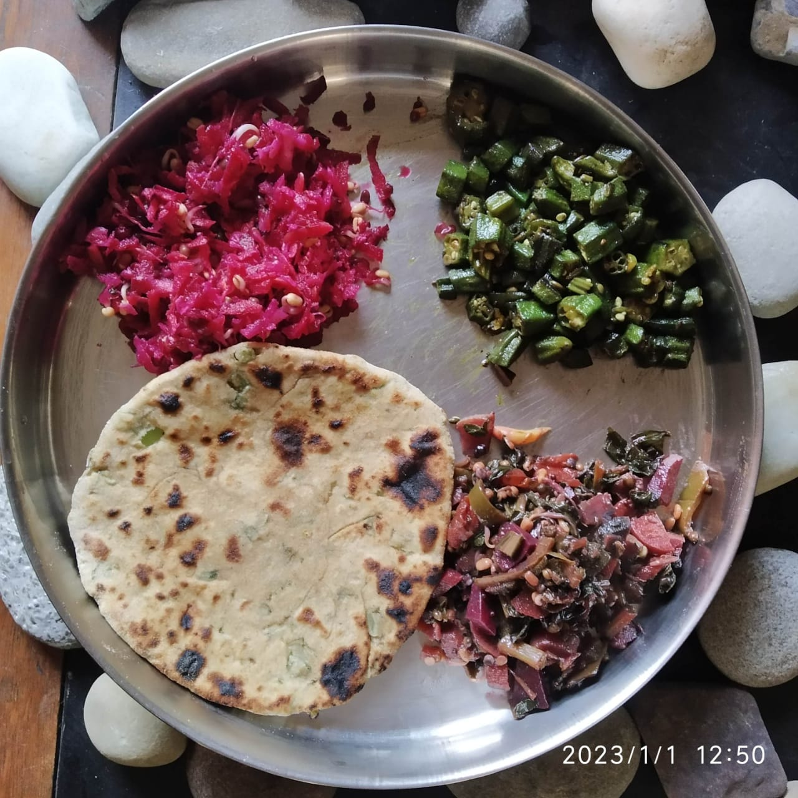

# 2023

Latest on top

## April

### 2023-04-12

#### _Dheu_ Amla Aloo Kela Sabzi

- Chop [dheu](https://himalayanwildfoodplants.com/2020/09/artocarpus-lacucha-buch-ham-dheu-%E0%A4%A2%E0%A5%87%E0%A4%8A/), gooseberries, potatoes, one raw banana. 
- Chop garlic cloves, onion. 
- Temper with mustard oil, whole spices, curry leaves' powder. Use of black pepper recommended. 
- Add little water once chopped vegetables, salt and turmeric have been put. 
- Cook in pressure cooker on low flame until _sabzi_ is properly cooked. 

### 2023-04-05

#### Urad Methi Daal

- Boil (cook at low flame on pressure cooker) soaked Urad daal, chopped onions and tomatoes, chopped garlic and fenugreek leaves (methi).
- Once steam released after daal is cooked, tempering done in ghee, cumin seeds and coriander seeds.
- Sufficiently cooked (at low flame) to let daal mix properly with vegetables.

#### Tinda Chukandar Dheu Methi sookhi sabzi

- Cut tinda, finely chopped beetroot, fenugreek leaves and dheu cut.
- Tempering: Mustard oil, cumin seeds, mustard seeds, fennel seeds, coriander seeds, fenugreek seeds, onion seeds (kalaunji)
- All chopped vegetables added, turmeric powder and salt added (as per taste).
- Cooked at low flame on pressure cooker.

## March

### 2023-03-27 

#### Red Rice Kheer

- Boiled milk in pan. 
- Red Rice soaked about 30-40 minutes. 
- Dry fruits (raisins, cashew nuts) washed, almonds sliced. 
- Rice boiled in milk until it's completely cooked. 
- Dry fruits added few minutes before rice about to be cooked. 
- For sweetness, _dhage wali mishri_ (thread rock sugar) used. 
- Roasted fox nuts also added. 
- Very good taste of the delicacy! 

### 2023-03-03

#### Aloo Carrot Coriander

- Cleaned, peeled, cut carrot (1, long), potatoes; and cleaned, chopped coriander leaves (most on quantity out of three). 
- One onion sliced for tempering with thinly sliced ginger. 
- Whole Spices for tempering used: Cumin seeds, Fenugreek seeds, Coriander seeds, Fennel seeds, Asafoetida, Mustard seeds 
- After vegetables put in cooker, turmeric powder, salt, garam masala poured on top. 
- Some water added (close to a full glass)
- 5-6 whistles on pressure cooker. 
- Mixed well after steam is released. 
- Great curry! 

## February

### 2023-02-24

#### Turnip Stuffed Roti

- Big turnip grated. 
- Sauted with whole spices (seeds: fenugreek, coriander, fennel, mustard; and asafoetida) on deep iron pan (kadhai) and turmeric and salt. 
- Left to cool.
- Made like a stuffed parantha/roti. 
- Wonderful in taste. Must be tried recipe. 

## January

### 2023-01-29

#### Sooji Bajra Halwa 

- Roast Sooji in ghee. Once sooji is half roasted add equal quantity of Bajra flour. Roast well. 
- Add _Shakkar_ mixed water, heated on pan. 
- Add crushed nuts: Almond, walnuts, cashew nuts. Soaked and sliced _chuaaras/dates_ added. Raisins added in the end once halwa is almost cooked.  
- Once thoroughly halwa has been cooked keep covered with a lid/plate so that raisins soften and swell.
- Sooji takes time to completely cook so add more water and stir well continuously. 

### 2023-01-17

#### Oat Meal 

- All vegetables (carrot, potatoes, bottle guard, onion, ginger) available evenly chopped. Peeled garlic cloves. 
- Green gram soaked in water (10-15 minutes). 
- Tempering in Yellow Mustard oil: Flax seeds, cumin seeds, coriander seeds, Fenugreek seeds,  fennel seeds, Asafoetida, black pepper, carom seeds, clove, sesame seeds, Mustard seeds, dried curry leaves
- Vegetables and lentils added after tempering prepared. One cup oats added in pressure cooker. Water added. 
- Once all cooked and steam released, mix lemon juice (of one lemon squeezed) in whole oatmeal. 
- Served. 

### 2023-01-04

#### Beetroot Chapati

- Finely grated beetroot (1). Grater having small holes used for fine grating. 
- Dough: Carom seeds, Flaxseeds, Whole wheat flour, Grated Beetroot, Mustard Oil 2 Table Spoons
- After kneading, dough kept covered for few minutes before making chapatis. 

`Today's lunch`

### 2023-01-02

#### Mixed Veg

- One beetroot, one carrot, one turnip, 4-5 capsicums, 2 potatoes, 2 tomatoes, 4 medium sized onions, very little - chopped radish leaves, 7-8 medium sized garlic cloves, 300-400 grams sprouted green gram 
- Tadka/chhaunk: Yellow Mustard oil, Asafoetida, Coriander seeds, stone crushed black pepper-mustard seeds-fenugreek seeds-fennel seeds-carom seeds
- All sliced/chopped vegetables added to iron pan, turmeric & salt added after few minutes of cooking. 

`Raw stage on pan`

### 2023-01-01

#### Beetroot Turnip Carrot Radish Sprouted Green Gram Salad 

- Grated 1 beetroot, 1 turnip, 1 carrot, 1/4 radish
- Added salt, chaat masala, pudina powder and lemon juice 
- Mixed thoroughly and kept in glass bowl for sometime before taking in meal. 

`Today's lunch`

## Insights
- Pudina powder goes well with beetroot in salad. 
- Grated carrot mixed in dough makes nice chapati. 
- Usage of Giloy, Ginger, Black pepper in _kaadha_ during winters is helpful. 
- Hot concoction of Peepal leaves, Tulsi, Giloy, Ginger, Harsingar, Guava leaves, Dhaage wali mishri being taken in throat infection

- Gehu and makki aata make good combination together for halwa. Ratios can be 1:1 or 1:2 respectively. 
- Adding kasuri methi in lentils once daal is cooked and tempering/_tadka_ is put gives amazing flavour. 
- Chhilke wali moong daal, arhar daal, malka daal make great combination when cooked together. 
- Lal aloo (a variety of potato) is better cooked in pressure cooker. 
- Upma tastes better when cooked in gravy of buttermilk and water mixed. 
- Fox nuts ("makhana") must be roasted in sesame oil. 
- Flax seeds added in tempering of dry curry of potato and radish gives great flavour and is a good idea to include flax seeds by way of curry. 
